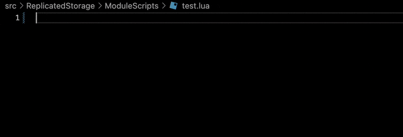
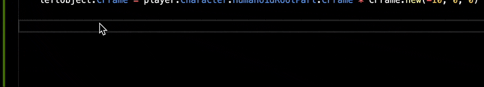
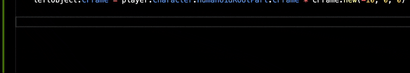
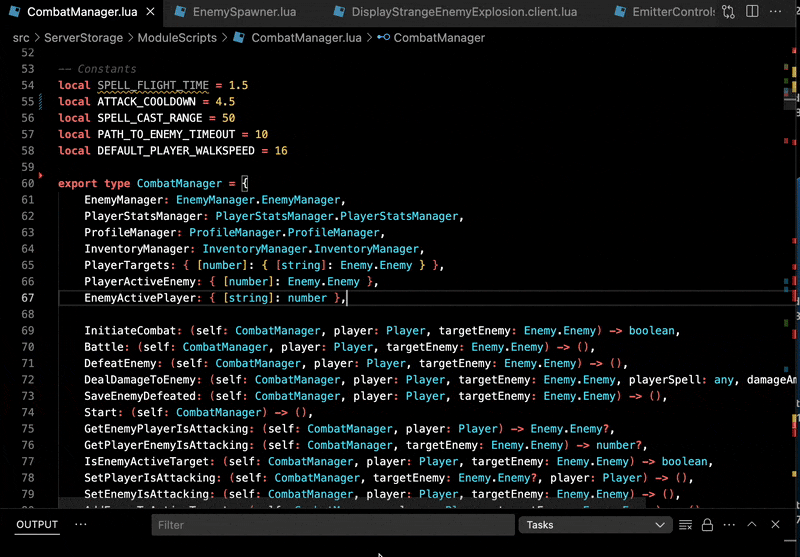
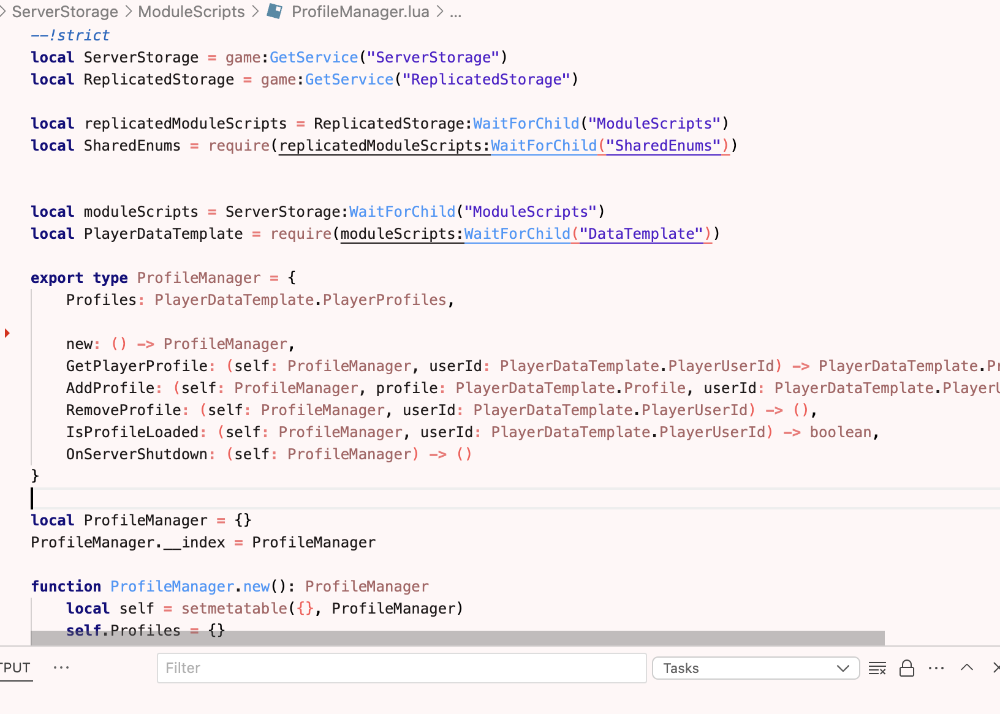
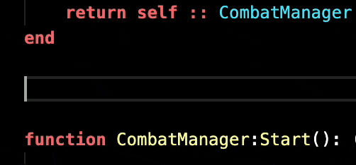
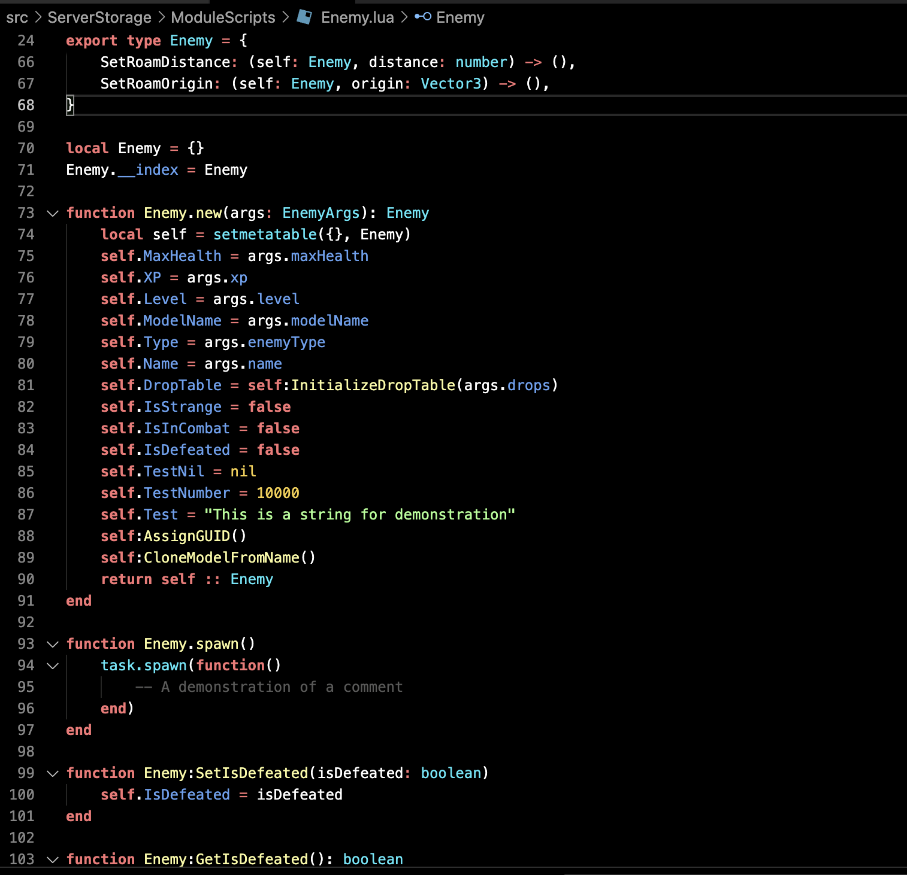
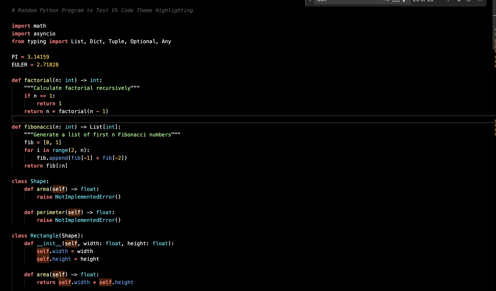
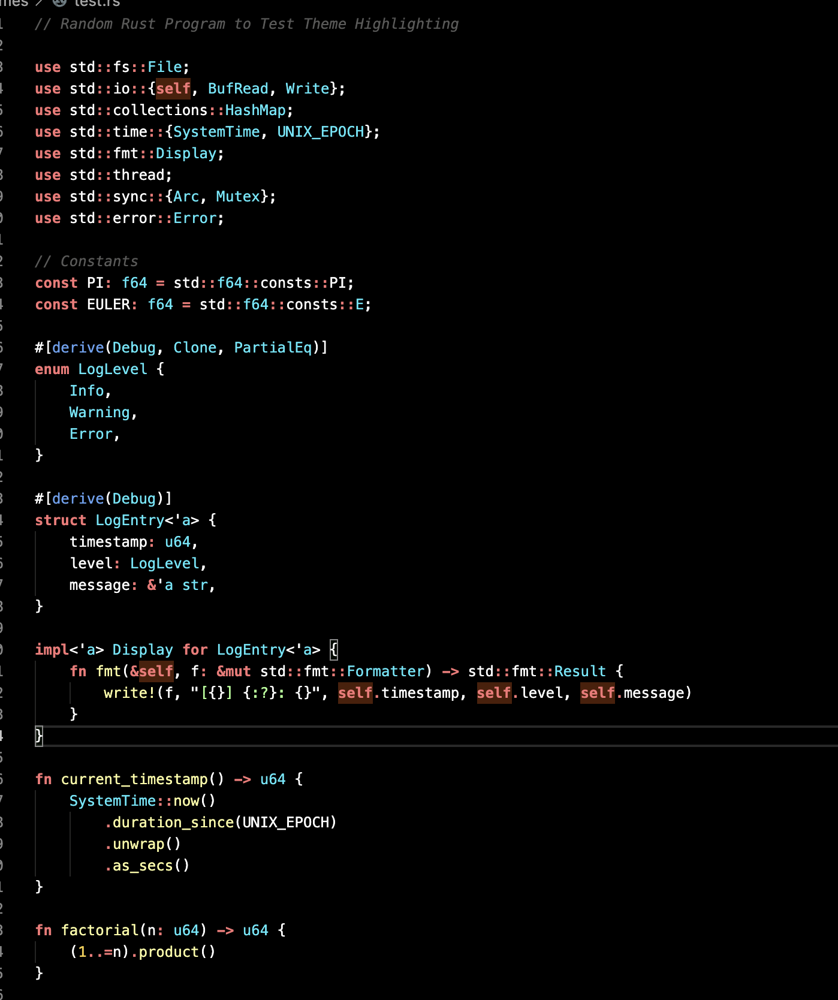

# Roblox IDE

Inspired by Roblox Studio's syntax highlighting, this plugin enables similar syntax highlighting in VSCode. Now it comes with auto-insertion, Go To Class Method Definition, Go To Type, and Smart Indent On Paste functionality!

[Luau Language Server](https://marketplace.visualstudio.com/items?itemName=JohnnyMorganz.luau-lsp) is required for the best experience.

# [New 03-26-2025] Auto-insert ModuleScript boilerplate

# [New 03-23-2025] Smart Indent On Paste

Ever tried to paste some code you copied and the indentation gets all messed up when you paste it? Smart Indent On Paste aims to solve this problem. 

## Current behavior WITHOUT smart indent enabled

## Current behavior WITH smart indent enabled

# [New 03-21-2025] [Basic Support] Use control + click or command + click to Go To Function definition

# [New 03-21-2025] Use control + click or command + click to Go To Type definition

# [New 03-21-2025] Roblox Light Theme 

# [New 03-19-2025] Auto-insert end, do, then 

# [New 03-17-2025] Multi-Language Support 

With this repo open in VSCode, press F5 to run the plugin in debug mode and test changes.