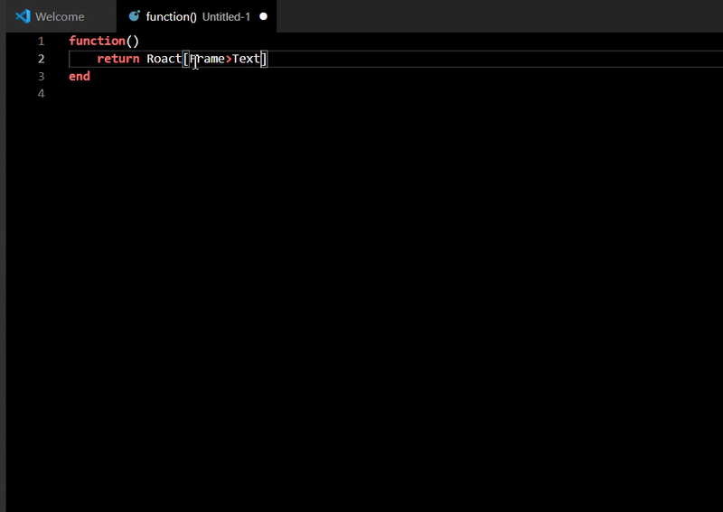
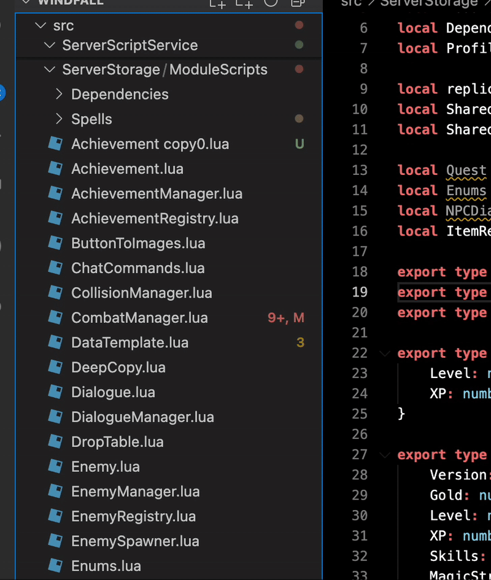

# Roblox IDE

Inspired by Roblox Studio's syntax highlighting, this plugin enables similar syntax highlighting in VSCode. Now it comes with auto-insertion, Go To Class Method Definition, Go To Type, Right-Click To Duplicate Script, and Smart Indent On Paste functionality!

[Luau Language Server](https://marketplace.visualstudio.com/items?itemName=JohnnyMorganz.luau-lsp) is required for the best experience.

# Features
- **Syntax Highlighting**: Syntax highlighting inspired by Roblox Studio.

- **Auto Insert Do, Then, End**: When typing a keyword that requires an enclosing keyword, press Enter and it will be autofilled much like Roblox Studio.

- **Go To Class Method Definition:** Go To Static Function already works in Roblox Studio and in VSCode wIth Luau LSP. This extension enhances that functionality by allowing Go To Class Method in VSCode. Hold control/command + click a token to activate. Not recommended for use with large projects, this feature is toggleable.

- **Go To Type Definition:** When holding control/command and clicking a Type token, the user will be taken to the type definition. Not recommended for use with large projects, this feature is toggleable. 

- **Smart Indent On Paste:** Not everyone copies and pastes a lot in their workflows. Personally, I do. I often shift things around as I'm working. I found that when I would paste something, the first line would always be overindented and I had to backspace to get it to align. Long story short this fixes that problem.

- **Duplicate Or Create Script:** Now, just like Roblox Studio, you can right click a script to duplicate it. When used on a valid directory, it will create a lua script with an appropriate extension depending on the directory.

# [New 04-04-2025] Roact AutoComplete/Emmets 

# [New 03-27-2025] Right-Click to Duplicate or Create Script

Now, just like in Roblox Studio, you can right click an existing lua file to duplicate it. If you use this command on a directory,
it will create a new lua file with an appropriate extension depending on the directory.

# [New 03-26-2025] Auto-insert ModuleScript boilerplate

# [New 03-23-2025] Smart Indent On Paste

Ever tried to paste some code you copied and the indentation gets all messed up when you paste it? Smart Indent On Paste aims to solve this problem. 

## Current behavior WITHOUT smart indent enabled

## Current behavior WITH smart indent enabled

# [New 03-21-2025] [Basic Support] Use control + click or command + click to Go To Function definition

# [New 03-21-2025] Use control + click or command + click to Go To Type definition

# [New 03-21-2025] Roblox Light Theme 

# [New 03-19-2025] Auto-insert end, do, then 

# [New 03-17-2025] Multi-Language Support 

With this repo open in VSCode, press F5 to run the plugin in debug mode and test changes.